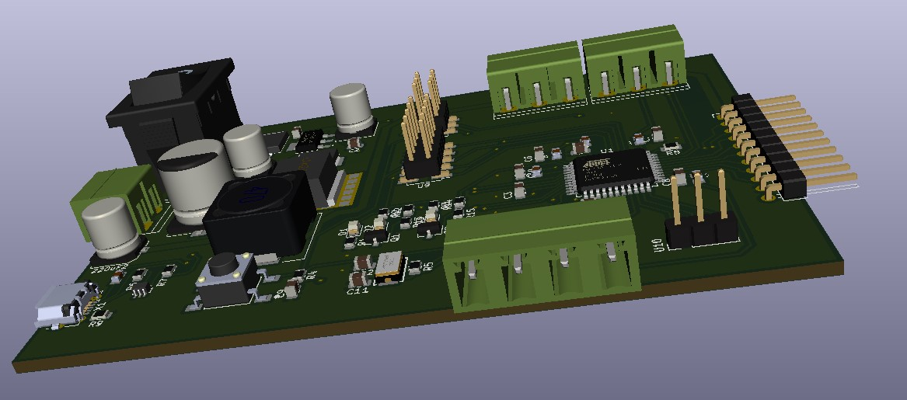
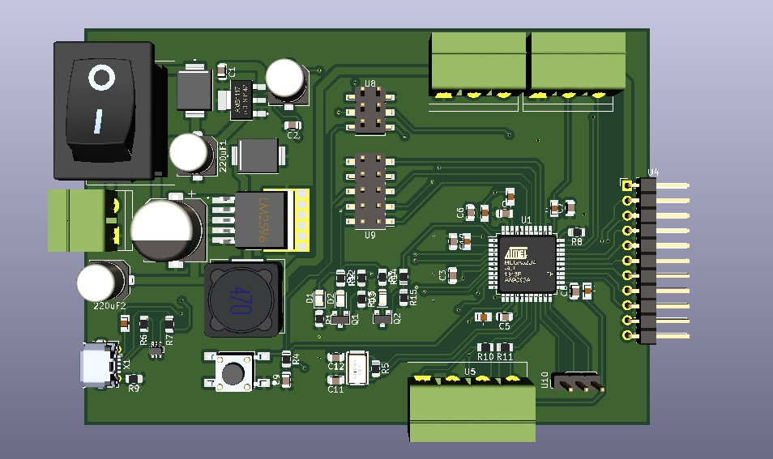

# Introduction to Tickatroller Ver1.0
- Tickatroller Ver1.0 is a control board for line follow car. Tickatroller have some functional blocks such as : encoder reader, esc control, serrvo control and 8 analog input. Besides that, it has jtag and icsp which makes debugging easier.
- Tickatroller use 12V power supply, and user must connect board with power supply before run or burn code.
- This project doesn't include souce code.

    Side view of 3d render board with KiCad.

    Top view of 3d render board with KiCad.

